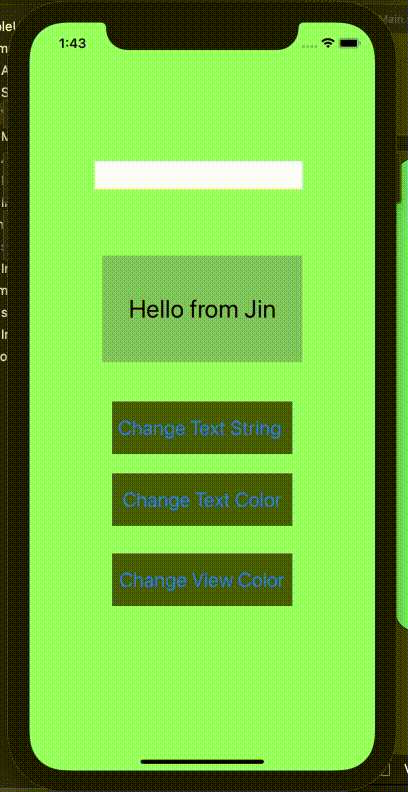

# ios-prework-repo
## Simple UI

### App Description
This simple app will use user input and replace it in the textbox. If it is empty, use default goodby. 
You can also change the text color to yellow and background view to red. 
If click elsewhere, it will go back to the old setting. 
All feature including the optional is implemented here. 

### App Walk-though

 

### Required User Stories
- [x] 1. User sees custom text in a label - Hello from {name}!
- [x] 2. User see's custom background color.
- [x] 3. User can tap a button to change the text color of the label.

### Optional User Stories
- [x] 1. User can tap a button to change the color of the background view.
- [x] 2. User can tap a button to change the text string of the label - Goodbye 👋.
- [x] 3. User can tap on the background view to reset all views to default settings.
- [x] 4. User can update the label text with custom text entered into the text field.
   - [x] a. User can enter text into a text field using the keyboard.
   - [x] b. User can tap the "Change text string" button to update the label with the text from the text field.
   - [x] c. If the text field is empty, update label with default text string.
   - [x] d. The keyboard is dismissed after the button has been tapped.
